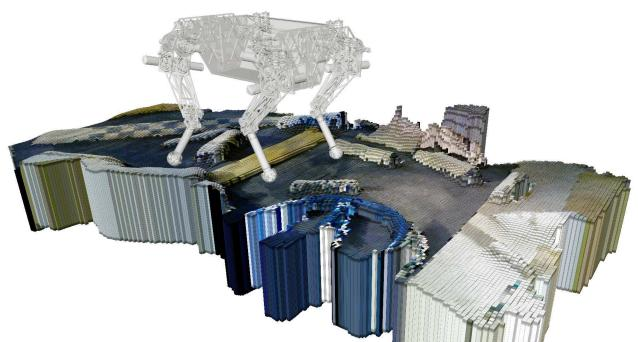

Robot-Centric Elevation Mapping
======================

Overview
---------------

This is a collection of [ROS] packages developed for local elevation mapping with a mobile robot. The software is designed for (local) navigation tasks with robots which are equipped with a pose estimation (e.g. IMU & odometry) and a distance sensor (e.g. kinect, laser range sensor). The provided elevation map is limited around the robot and reflects the pose uncertainty that is aggregated through the motion of the robot (robot-centric mapping). This method is developed to explicitly handle drift of the robot pose estimation.

The Robot-Centric Elevation Mapping packages have been tested under ROS Groovy and Ubuntu 13.04. This is research code, expect that it changes often and any fitness for a particular purpose is disclaimed.

**Author: Peter Fankhauser, pfankhauser@ethz.ch 
Affiliation: Autonomous Systems Lab, ETH Zurich**

Citing
---------------

The robot-centric elevation mapping methods used in this software are described in the following paper (available [here]()):

P. Fankhauser, M. Bloesch, C. Gehring, M. Hutter, and R. Siegwart,
**"Robot-centric elevation mapping with uncertainty estimates"**,
in Climbing and Walking Robots (CLAWAR), 2014.

    @inproceedings{Fankhauser2014RobotCentricElevationMapping,
      author = {Fankhauser, Péter and Bloesch, Michael and Gehring, Christian and Hutter, Marco and Siegwart, Roland},
      title = {Robot-centric elevation mapping with uncertainty estimates},
      booktitle = {Climbing and Walking Robots (CLAWAR)},
      year = {2014}
    }

Watch the [video](http://www.youtube.com/watch?v=I9eP8GrMyNQ) demonstrating the Robot-Centric Elevation Mapper: 

Installation
------------

### Dependencies

This software is built on the Robotic Operating System ([ROS]), which needs to be [installed](http://wiki.ros.org) first. Additionaly, the Robot-Centric Elevation Mapper depends on following software:

- [Eigen](http://eigen.tuxfamily.org) (linear algebra library),
- [kindr](http://github.com/ethz-asl/kindr) (kinematics and dynamics library for robotics),
- [Schweizer-Messer](http://github.com/ethz-asl/Schweizer-Messer) (programming tools for robotics),
- [Point Cloud Library (PCL)](http://pointclouds.org/) (point cloud processing).

### Building

In order to install the Robot-Centric Elevation Mapper, clone the latest version from this repository into your catkin workspace and compile the package using ROS.

    cd catkin_workspace/src
    git clone https://github.com/ethz-asl/elevation_mapping.git
    cd ../
    catkin_make

### Unit Tests

Run the unit tests with

    catkin_make run_tests_elevation_map_msg run_tests_elevation_mapping

Basic Usage
------------

In order to get the Robot-Centric Elevation Mapper to run with your robot, you will need to adapt a few parameters. It is the easiest if duplicate and adapt all the parameter files that you need to change in `elevation_mapping/parameters/`. Then, change the entries in the launch-file `elevation_mapping/launch/eisualization elevation_map_visualization.launch

Use [rviz] to visualize the elevation map. A sample [rviz] configuration file is provded under `/elevation_map_visualization/rviz/rviz_configuration.rviz`.

Nodes
------------

### Node: elevation_mapping

This is the main Robot-Centric Elevation Mapping node. It uses the distance sensor measurements and the pose and covariance of the robot to generate an elevation map with variance estimates.

#### Subscribed Topics

* **`/points`** ([sensor_msgs/Poilevation_mapping.launch` to point at your parameter files. You can then launch the elevation mapping node with

	roslaunch elevation_mapping elevation_mapping.launch

Proceed in the same way for the elevation map visualization by adapting the launch-file `elevation_map_visualization/launch/elevation_map_visualization.launch`. You can then launch the elevation map visualization node with

	roslaunch elevation_map_vntCloud2])

    The distance measurements.
    
* **`/robot_state/pose`** ([geometry_msgs/PoseWithCovarianceStamped])

    The robot pose and covariance.
    
#### Published Topics

* **`/elevation_map`** ([elevation_map_msg/ElevationMap])

    The entire (fused) elevation map. Is only published after the `trigger_fusion` service is called.
    
* **`/elevation_map_raw`** ([elevation_map_msg/ElevationMap])

    The entire (raw) elevation map before the fusion step.

#### Services

* **`trigger_fusion`** ([std_srvs/Empty])

    Trigger the fusing process for the entire elevation map and publish it. For example, you can trigger the map fusion step from the console with

        rosservice call /elevation_mapping/trigger_fusion
    
* **`get_submap`** ([elevation_map_msg/GetSubmap])

    Get a fused elevation submap for a requested position and size. For example, you can get the fused elevation submap at position (-0.5, 0.0) and size (0.5, 1.2) and safe it to a text file form the console with

        rosservice call -- /elevation_mapping/get_submap -0.5 0.0 0.5 1.2 false false > elevation_submap.txt

#### Parameters

* **`point_cloud_topic`** (string, default: "/points")
 
    The name of the distance measurements topic.

* **`robot_pose_topic`** (string, default: "/robot_state/pose")
 
    The name of the robot pose and covariance topic.

* **`base_frame_id`** (string, default: "/robot")
 
    The id of the robot base tf frame.
    
* **`parent_frame_id`** (string, default: "/map")
 
    The id of the parent tf frame of the elevation map.

* **`elevation_map_frame_id`** (string, default: "/elevation_map")
 
    The id of the tf frame of the elevation map.

* **`track_point_frame_id`** (string, default: "/robot")
 
    The elevation map is moved along with the robot following a *track point*. This is the id of the tf frame in which the track point is defined.

* **`track_point_x`**, **`track_point_y`**, **`track_point_z`** (double, default: 0.0, 0.0, 0.0)

    The elevation map is moved along with the robot following a *track point*. This is the position of the track point in the `track_point_frame_id`.
    
* **`robot_pose_cache_size`** (int, default: 200, min: 0)
 
    The size of the robot pose cache.

* **`min_update_rate`** (double, default: 2.0)
 
    The mininum update rate (in Hz) at which the elevation map is updated either from new measurements or the robot pose estimates.

* **`relocate_rate`** (double, default: 3.0)
 
    The rate (in Hz) at which the elevation map is checked for relocation following the tracking point.

* **`length_in_x`**, **`length_in_y`** (double, default: 1.5, min: 0.0)
 
    The size of the elevation map.

* **`position_x`**, **`position_y`** (double, default: 0.0)
 
    The position of the elevation map (center) in the elevation map frame.

* **`resolution`** (double, default: 0.01, min: 0.0)
 
    The resolution (cell size in m/cell) of the elevation map.

* **`min_variance`**, **`max_variance`** (double, default: 9.0e-6, 0.01)

    The minimum and maximum values for the elevation map variance data.
    
* **`mahalanobis_distance_threshold`** (double, default: 2.5)

    The threshold for the Mahalanobis distance. Decides if measurements are fused with the existing data, overwritten or ignored.
    
* **`multi_height_noise`** (double, default: 9.0e-7)

    Added noise for cell with multiple height measurements (e.g. walls).
    
* **`min_horizontal_variance`**, **`max_horizontal_variance`** (double, default: pow(resolution / 2.0, 2), 0.5)

    The minimum and maximum values for the elevation map horizontal variance data.
    
* **`sensor_cutoff_min_depth`**, **`sensor_cutoff_max_depth`** (double, default: 0.2, 2.0)

    The minimum and maximum values for the length of the distance sensor measurements. Measurements outside this interval are ignored.
    
* **`sensor_model_normal_factor_a`**, **`sensor_model_normal_factor_b`**, **`sensor_model_normal_factor_c`**, **`sensor_model_lateral_factor`** (double)

    The data for the sensor noise model. 
    
### Node: elevation_map_visualization

This node subscribes to an elevation map topic and publishes the corresponding marker array message that can be visualized in [rviz].

#### Subscribed Topics

* **`/elevation_map`** ([elevation_map_msg/ElevationMap])

    The elevation map (fused or raw) to visualize.

#### Published Topics

* **`/elevation_map_marker_array`** ([visualization_msgs/MarkerArray])

    The elevation map marker array that can be visualized in [rviz].

* **`/elevation_map_region`** ([geometry_msgs/PolygonStamped])

    The elevation map region that can be visualized in [rviz].

#### Parameters

* **`elevation_map_topic`** (string, default: "/elevation_mapping/elevation_map")
 
    The name of the elevation map topic to be visualized.

*Note: There are many more parameters which we skip here as this node will be rewritten soon.*

### Package: elevation_map_msg

Definition of the elevation map message type and services. It also contains helper functions that facilitate the handling and conversion of elevation map messages.

* **`ElevationMap`** ([elevation_map_msg/ElevationMap])

    Definition of the elevation map message type.

* **`GetSubmap`** ([elevation_map_msg/GetSubmap])

    Definition of the service for requesting an elevation submap.

Bugs & Feature Requests
------------

Please report bugs and request features using the [Issue Tracker](https://github.com/ethz-asl/elevation_mapping/issues).

[ROS]: http://www.ros.org
[rviz]: http://wiki.ros.org/rviz
[elevation_map_msg/ElevationMap]: elevation_map_msg/msg/ElevationMap.msg
[sensor_msgs/PointCloud2]: http://docs.ros.org/api/sensor_msgs/html/msg/PointCloud2.html
[geometry_msgs/PoseWithCovarianceStamped]: http://docs.ros.org/api/geometry_msgs/html/msg/PoseWithCovarianceStamped.html
[std_srvs/Empty]: http://docs.ros.org/api/std_srvs/html/srv/Empty.html
[elevation_map_msg/GetSubmap]: elevation_map_msg/srv/GetSubmap.srv
[visualization_msgs/MarkerArray]: http://docs.ros.org/api/visualization_msgs/html/msg/MarkerArray.html
[geometry_msgs/PolygonStamped]: http://docs.ros.org/api/geometry_msgs/html/msg/PolygonStamped.html
