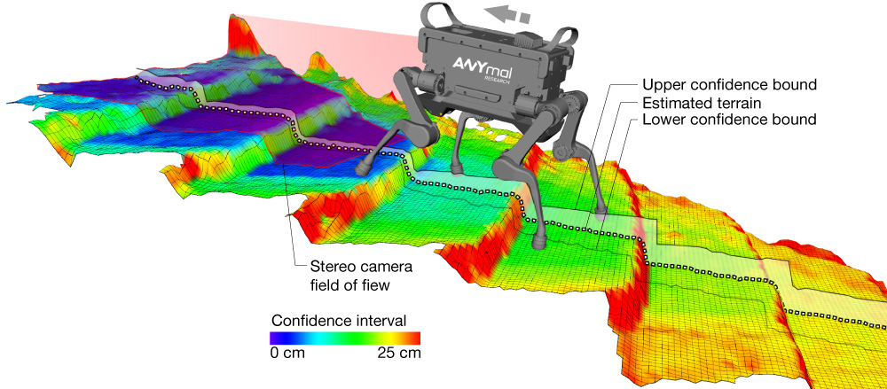
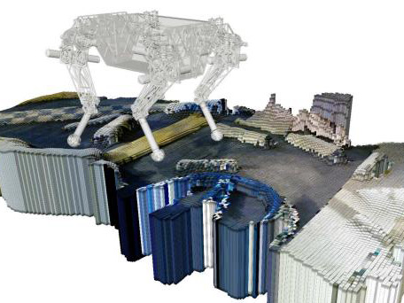
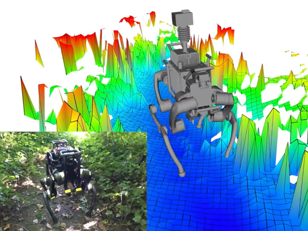
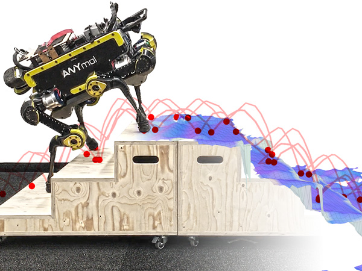
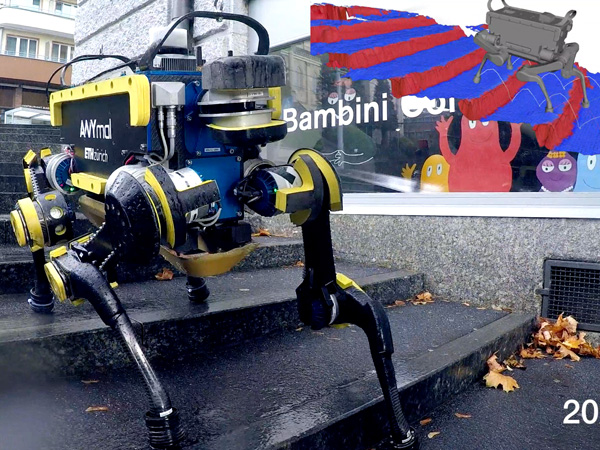

# Robot-Centric Elevation Mapping

## Overview

This is a [ROS] package developed for elevation mapping with a mobile robot. The software is designed for (local) navigation tasks with robots which are equipped with a pose estimation (e.g. IMU & odometry) and a distance sensor (e.g. structured light (Kinect, RealSense), laser range sensor, stereo camera). The provided elevation map is limited around the robot and reflects the pose uncertainty that is aggregated through the motion of the robot (robot-centric mapping). This method is developed to explicitly handle drift of the robot pose estimation.

The Robot-Centric Elevation Mapping packages have been tested under ROS Melodic and Ubuntu 18.04. This is research code, expect that it changes often and any fitness for a particular purpose is disclaimed.

The source code is released under a [BSD 3-Clause license](LICENSE).

**Author: Péter Fankhauser 
Affiliation: [ANYbotics](https://www.anybotics.com/) 
Maintainer: Péter Fankhauser, pfankhauser@anybotics.com **

This projected was initially developed at ETH Zurich (Autonomous Systems Lab & Robotic Systems Lab).

[This work is conducted as part of ANYmal Research, a community to advance legged robotics.](https://www.anymal-research.org/)

Videos of the elevation mapping software in use:

## Citing

The robot-centric elevation mapping methods used in this software are described in the following paper (available [here](https://doi.org/10.3929/ethz-b-000272110)). If you use this work in an academic context, please cite the following publication(s):

* > P. Fankhauser, M. Bloesch, and M. Hutter,
  > **"Probabilistic Terrain Mapping for Mobile Robots with Uncertain Localization"**,
  > in IEEE Robotics and Automation Letters (RA-L), vol. 3, no. 4, pp. 3019–3026, 2018. ([PDF](http://dx.doi.org/10.1109/LRA.2018.2849506))

        @article{Fankhauser2018ProbabilisticTerrainMapping,
          author = {Fankhauser, P{\'{e}}ter and Bloesch, Michael and Hutter, Marco},
          doi = {10.1109/LRA.2018.2849506},
          title = {Probabilistic Terrain Mapping for Mobile Robots with Uncertain Localization},
          journal = {IEEE Robotics and Automation Letters (RA-L)},
          volume = {3},
          number = {4},
          pages = {3019--3026},
          year = {2018}
        }

* > P. Fankhauser, M. Bloesch, C. Gehring, M. Hutter, and R. Siegwart,
  > **"Robot-Centric Elevation Mapping with Uncertainty Estimates"**,
  > in International Conference on Climbing and Walking Robots (CLAWAR), 2014. ([PDF](http://dx.doi.org/10.3929/ethz-a-010173654))

        @inproceedings{Fankhauser2014RobotCentricElevationMapping,
          author = {Fankhauser, P\'{e}ter and Bloesch, Michael and Gehring, Christian and Hutter, Marco and Siegwart, Roland},
          title = {Robot-Centric Elevation Mapping with Uncertainty Estimates},
          booktitle = {International Conference on Climbing and Walking Robots (CLAWAR)},
          year = {2014}
        }

## Installation

### Dependencies

This software is built on the Robotic Operating System ([ROS]), which needs to be [installed](http://wiki.ros.org) first. Additionally, the Robot-Centric Elevation Mapping depends on following software:

- [Grid Map](https://github.com/anybotics/grid_map) (grid map library for mobile robots)
- [kindr](http://github.com/anybotics/kindr) (kinematics and dynamics library for robotics),
- [kindr_ros](https://github.com/anybotics/kindr_ros) (ROS wrapper for kindr),
- [Point Cloud Library (PCL)](http://pointclouds.org/) (point cloud processing),
- [Eigen](http://eigen.tuxfamily.org) (linear algebra library).

### Building

In order to install the Robot-Centric Elevation Mapping, clone the latest version from this repository into your catkin workspace and compile the package using ROS.

    cd catkin_workspace/src
    git clone https://github.com/anybotics/elevation_mapping.git
    cd ../
    catkin_make

### Unit Tests

Run the unit tests with

    catkin_make run_tests_elevation_map_msg run_tests_elevation_mapping

## Basic Usage

In order to get the Robot-Centric Elevation Mapping to run with your robot, you will need to adapt a few parameters. It is the easiest if duplicate and adapt all the parameter files that you need to change from the `elevation_mapping_demos` package (e.g. the `simple_demo` example). These are specifically the parameter files in `config` and the launch file from the `launch` folder.

## Nodes

### Node: elevation_mapping

This is the main Robot-Centric Elevation Mapping node. It uses the distance sensor measurements and the pose and covariance of the robot to generate an elevation map with variance estimates.

#### Subscribed Topics

* **`/points`** ([sensor_msgs/PointCloud2])

    The distance measurements.

* **`/pose`** ([geometry_msgs/PoseWithCovarianceStamped])

    The robot pose and covariance.

* **`/tf`** ([tf/tfMessage])

    The transformation tree.

#### Published Topics

* **`elevation_map`** ([grid_map_msgs/GridMap])

    The entire (fused) elevation map. It is published periodically (see `fused_map_publishing_rate` parameter) or after the `trigger_fusion` service is called.

* **`elevation_map_raw`** ([grid_map_msgs/GridMap])

    The entire (raw) elevation map before the fusion step.

#### Services

* **`trigger_fusion`** ([std_srvs/Empty])

    Trigger the fusing process for the entire elevation map and publish it. For example, you can trigger the map fusion step from the console with

        rosservice call /elevation_mapping/trigger_fusion

* **`get_submap`** ([grid_map_msgs/GetGridMap])

    Get a fused elevation submap for a requested position and size. For example, you can get the fused elevation submap at position (-0.5, 0.0) and size (0.5, 1.2) described in the odom frame and safe it to a text file form the console with

        rosservice call -- /elevation_mapping/get_submap odom -0.5 0.0 0.5 1.2 []

* **`get_raw_submap`** ([grid_map_msgs/GetGridMap])

    Get a raw elevation submap for a requested position and size. For example, you can get the raw elevation submap at position (-0.5, 0.0) and size (0.5, 1.2) described in the odom frame and safe it to a text file form the console with

        rosservice call -- /elevation_mapping/get_raw_submap odom -0.5 0.0 0.5 1.2 []

* **`clear_map`** ([std_srvs/Empty])

    Initiates clearing of the entire map for resetting purposes. Trigger the map clearing with

        rosservice call /elevation_mapping/clear_map

* **`masked_replace`** ([grid_map_msgs/SetGridMap])

    Allows for setting the individual layers of the elevation map through a service call. The layer mask can be used to only set certain cells and not the entire map. Cells containing NAN in the mask are not set, all the others are set. If the layer mask is not supplied, the entire map will be set in the intersection of both maps. The provided map can be of different size and position than the map that will be altered. An example service call to set some cells marked with a mask in the elevation layer to 0.5 is

        rosservice call /elevation_mapping/masked_replace "map:
          info:
            header:
              seq: 3
              stamp: {secs: 3, nsecs: 80000000}
              frame_id: 'odom'
            resolution: 0.1
            length_x: 0.3
            length_y: 0.3
            pose:
              position: {x: 5.0, y: 0.0, z: 0.0}
              orientation: {x: 0.0, y: 0.0, z: 0.0, w: 0.0}
          layers: [elevation,mask]
          basic_layers: [elevation]
          data:
          - layout:
              dim:
              - {label: 'column_index', size: 3, stride: 9}
              - {label: 'row_index', size: 3, stride: 3}
              data_offset: 0
            data: [0.5, 0.5, 0.5, 0.5, 0.5, 0.5, 0.5, 0.5, 0.5]
          - layout:
              dim:
              - {label: 'column_index', size: 3, stride: 9}
              - {label: 'row_index', size: 3, stride: 3}
              data_offset: 0
            data: [0, 0, 0, .NAN, .NAN, .NAN, 0, 0, 0]
          outer_start_index: 0
          inner_start_index: 0"

* **`save_map`** ([grid_map_msgs/ProcessFile])

    Saves the current fused grid map and raw grid map to rosbag files. Field `topic_name` must be a base name, i.e. no leading slash character (/). If field `topic_name` is empty, then `elevation_map` is used per default. Example with default topic name

        rosservice call /elevation_mapping/save_map "file_path: '/home/integration/elevation_map.bag' topic_name: ''"

#### Parameters

* **`point_cloud_topic`** (string, default: "/points")

    The name of the distance measurements topic.

* **`robot_pose_topic`** (string, default: "/robot_state/pose")

    The name of the robot pose and covariance topic.

* **`base_frame_id`** (string, default: "/robot")

    The id of the robot base tf frame.

* **`map_frame_id`** (string, default: "/map")

    The id of the tf frame of the elevation map.

* **`track_point_frame_id`** (string, default: "/robot")

    The elevation map is moved along with the robot following a *track point*. This is the id of the tf frame in which the track point is defined.

* **`track_point_x`**, **`track_point_y`**, **`track_point_z`** (double, default: 0.0, 0.0, 0.0)

    The elevation map is moved along with the robot following a *track point*. This is the position of the track point in the `track_point_frame_id`.

* **`robot_pose_cache_size`** (int, default: 200, min: 0)

    The size of the robot pose cache.

* **`min_update_rate`** (double, default: 2.0)

    The mininum update rate (in Hz) at which the elevation map is updated either from new measurements or the robot pose estimates.

* **`fused_map_publishing_rate`** (double, default: 1.0)

    The rate for publishing the entire (fused) elevation map.

* **`relocate_rate`** (double, default: 3.0)

    The rate (in Hz) at which the elevation map is checked for relocation following the tracking point.

* **`length_in_x`**, **`length_in_y`** (double, default: 1.5, min: 0.0)

    The size (in m) of the elevation map.

* **`position_x`**, **`position_y`** (double, default: 0.0)

    The position of the elevation map center, in the elevation map frame. This parameter sets the planar position offsets between the generated elevation map and the frame in which it is published (`map_frame_id`). It is only useful if no `track_point_frame_id` parameter is used.

* **`resolution`** (double, default: 0.01, min: 0.0)

    The resolution (cell size in m/cell) of the elevation map.

* **`min_variance`**, **`max_variance`** (double, default: 9.0e-6, 0.01)

    The minimum and maximum values for the elevation map variance data.

* **`mahalanobis_distance_threshold`** (double, default: 2.5)

    Each cell in the elevation map has an uncertainty for its height value. Depending on the Mahalonobis distance of the existing height distribution and the new measurements, the incoming data is fused with the existing estimate, overwritten, or ignored. This parameter determines the threshold on the Mahalanobis distance which determines how the incoming measurements are processed.

* **`sensor_processor/ignore_points_above`** (double, default: 0.4)
    A hard threshold on the height of points introduced by the depth sensor. Points with a height over this threshold will not be considered valid during the data collection step.

* **`multi_height_noise`** (double, default: 9.0e-7)

    Noise added to measurements that are higher than the current elevation map at that particular position. This noise-adding process is only performed if a point falls over the Mahalanobis distance threshold. A higher value is useful to adapt faster to dynamic environments (e.g., moving objects), but might cause more noise in the height estimation.

* **`min_horizontal_variance`**, **`max_horizontal_variance`** (double, default: pow(resolution / 2.0, 2), 0.5)

    The minimum and maximum values for the elevation map horizontal variance data.

* **`enable_visibility_cleanup`** (bool, default: true)

    Enable/disable a separate thread that removes elements from the map which are not visible anymore, by means of ray-tracing, originating from the sensor frame.

* **`visibility_cleanup_rate`** (double, default: 1.0)

    The rate (in Hz) at which the visibility constraint is performed.

* **`scanning_duration`** (double, default: 1.0)

    The sensor's scanning duration (in s) which is used for the visibility cleanup. Set this roughly to the duration it takes between two consecutive full scans (e.g. 0.033 for a ToF camera with 30 Hz, or 3 s for a rotating laser scanner). Depending on how dense or sparse your scans are, increase or reduce the scanning duration. Smaller values lead to faster dynamic object removal and bigger values help to reduce faulty map cleanups.

* **`sensor_cutoff_min_depth`**, **`sensor_cutoff_max_depth`** (double, default: 0.2, 2.0)

    The minimum and maximum values for the length of the distance sensor measurements. Measurements outside this interval are ignored.

* **`sensor_model_normal_factor_a`**, **`sensor_model_normal_factor_b`**, **`sensor_model_normal_factor_c`**, **`sensor_model_lateral_factor`** (double)

    The data for the sensor noise model.

## Bugs & Feature Requests

Please report bugs and request features using the [Issue Tracker](https://github.com/anybotics/elevation_mapping/issues).

[ROS]: http://www.ros.org
[rviz]: http://wiki.ros.org/rviz
[grid_map_msgs/GridMap]: https://github.com/anybotics/grid_map/blob/master/grid_map_msgs/msg/GridMap.msg
[sensor_msgs/PointCloud2]: http://docs.ros.org/api/sensor_msgs/html/msg/PointCloud2.html
[geometry_msgs/PoseWithCovarianceStamped]: http://docs.ros.org/api/geometry_msgs/html/msg/PoseWithCovarianceStamped.html
[tf/tfMessage]: http://docs.ros.org/kinetic/api/tf/html/msg/tfMessage.html
[std_srvs/Empty]: http://docs.ros.org/api/std_srvs/html/srv/Empty.html
[grid_map_msgs/GetGridMap]: https://github.com/anybotics/grid_map/blob/master/grid_map_msgs/srv/GetGridMap.srv
[grid_map_msgs/ProcessFile]: https://github.com/ANYbotics/grid_map/blob/master/grid_map_msgs/srv/ProcessFile.srv
